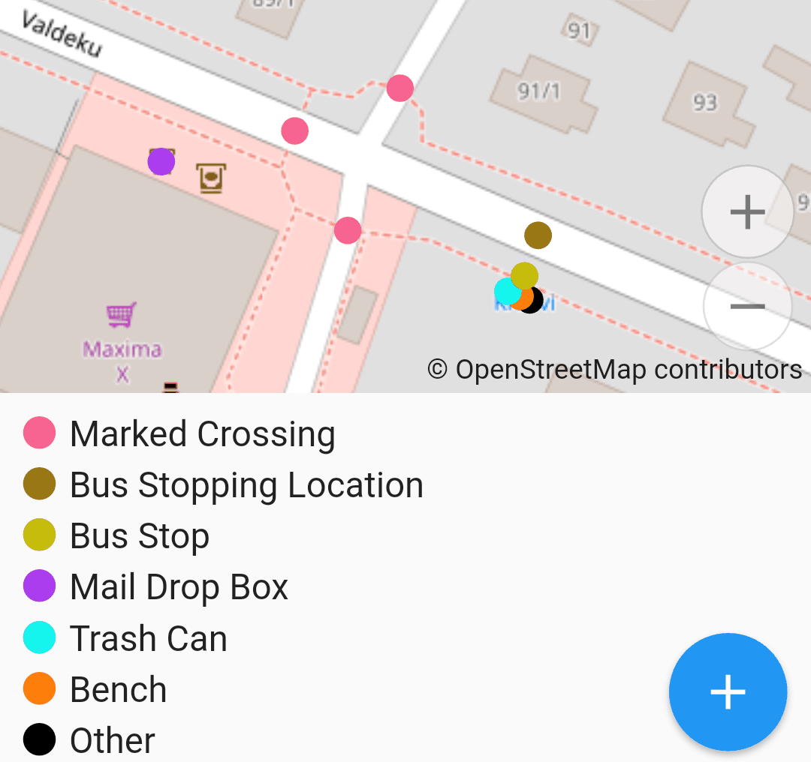
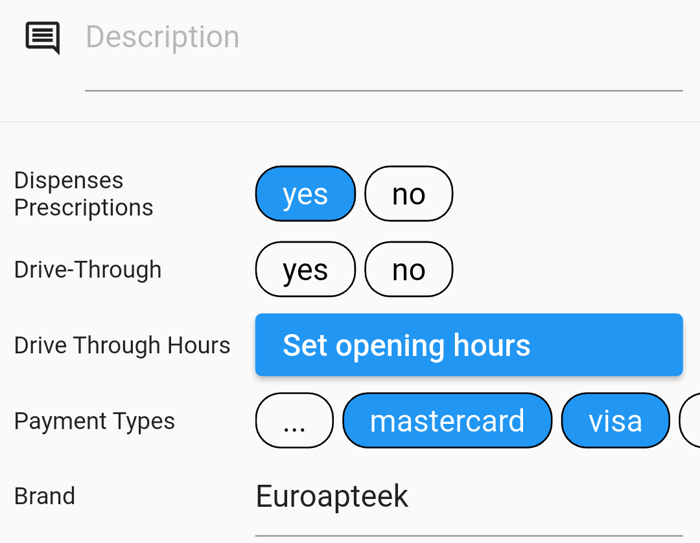

# Developing Presets

TL;DR:

* Presets: [repository](https://github.com/openstreetmap/id-tagging-schema/tree/main/data/presets), [schema](https://github.com/ideditor/schema-builder?tab=readme-ov-file#presets), mind the `fields`.
* Fields: [repository](https://github.com/openstreetmap/id-tagging-schema/tree/main/data/fields), [schema](https://github.com/ideditor/schema-builder?tab=readme-ov-file#fields), consider `strings/options` for combos.
* Brand Suggestions: [repository](https://github.com/osmlab/name-suggestion-index) and [wiki](https://github.com/osmlab/name-suggestion-index/wiki/Contributing).
* Local: see [presets in plugins](../plugins/metadata/presets.md).

## Global Presets

The editor uses [presets from iD](https://github.com/openstreetmap/id-tagging-schema).
If you find something missing: an object type, a field in an editing form — you should
take it upstream, to that repository, preferably in form of a pull request. This does
sound complex, and this page would help you through it.

You would benefit from keeping the [preset schema](https://github.com/ideditor/schema-builder?tab=readme-ov-file#presets)
at hand: it documents everything that goes into preset and field definitions.

### Presets

A preset is a named set of fixed and editable tags. For example, the
[amenity/bench](https://github.com/openstreetmap/id-tagging-schema/blob/main/data/presets/amenity/bench.json) preset
defines the fixed `amenity=bench` tag — that's how an object is deemed to be a bench.
Every Door uses those fixed tags to split objects by types in the micromapping mode,
and of course to get a list of fields for the editor.

{ width="300" }

Lists `fields` and `moreFields` define editable tags, split by importance (which usually
depends on usage frequency). Those reference [fields](#fields) by names. It is important
to have as few fields in the first list as possible — but also every field that can be
quickly assessed and provides useful, practical information.

Finally, a preset needs to be searchable. When a mapper sees a fish shop, they would
most likely search for "fish", and it doesn't matter that the OSM tag is `shop=seafood`.
That's why [the preset](https://github.com/openstreetmap/id-tagging-schema/blob/main/data/presets/shop/seafood.json)
includes an alias starting with "fish": search engines look at `name`, `aliases`, and `terms`
properties, including their [translations](translate.md#presets-and-fields).

That's basically it. Try [looking for the preset](https://github.com/openstreetmap/id-tagging-schema/tree/main/data/presets)
based on its tags, main and additional. If you find it there, then maybe consider adding
search terms so that other people won't have to do the same. If not — write the JSON file
according to the [schema](https://github.com/ideditor/schema-builder?tab=readme-ov-file#presets)
and using other files for reference, and submit a pull request.

You will see the update in Every Door after the request is merged, and a new editor release
is published. In the meantime, you could also make a [local preset](#personal-presets)
for yourself.

### Fields

Every input field and button you see on the object editing page is defined in some
field, referenced from a preset. Usually, barring very few special cases hard-coded
in Every Door, a field edits a single key value. Like for this
[backrest=\*](https://github.com/openstreetmap/id-tagging-schema/blob/main/data/fields/backrest.json)
field, usually all you need for a field is that key, a label, and a type.

{ width="300" }

If there is something wrong with a field, you can find it by locating the preset it is in,
reading the `fields` or `moreFields` list, and locating the field JSON source in the
[repository](https://github.com/openstreetmap/id-tagging-schema/tree/main/data/fields).
Often you would do this to add
[translatable options](https://github.com/ideditor/schema-builder?tab=readme-ov-file#strings)
to a combo field.

Before adding a new field that a preset requires, confirm it is indeed absent. Not all
fields are listed: sometimes people just forget that e.g. `capacity=*` fits not only
bicycle racks, but also benches. Note that there can be multiple fields for a single
key, when the context differs. For `capacity`, there are three, technically differing
only by labels:
[parking spaces](https://github.com/openstreetmap/id-tagging-schema/blob/main/data/fields/capacity_parking.json),
[countable capacity](https://github.com/openstreetmap/id-tagging-schema/blob/main/data/fields/capacity.json),
and [volume](https://github.com/openstreetmap/id-tagging-schema/blob/main/data/fields/capacity_volume.json).

As mentioned above, a new field might only need three properties:

```json
{
    "key": "tactile_paving",
    "type": "check",
    "label": "Tactile Paving"
}
```

Read the [schema definition](https://github.com/ideditor/schema-builder?tab=readme-ov-file#fields)
to learn where to put the file, and how to choose the `type`. It's the single most
important property with ~30 possible values, defining how the field looks and behaves.

Often you might want to add restrictions and details with other properties, e.g.
`placeholder` for text fields, `minValue` for numbers, `strings` for combo fields.
Those are also listed in the schema.

Note that by default, only `label` and `placeholder` are translatable.
For combo and checkbox fields you might want to make options translatable
too by listing the most common ones in the
[strings](https://github.com/ideditor/schema-builder?tab=readme-ov-file#strings) property.

As with presets, Every Door will see your change only after it's been merged and included
in the published build. And you can also [define a field](../plugins/metadata/presets.md#fields)
in your own plugin.

## Name Suggestion Index

When you map a KFC or a Shell fuel station, you would add many tags that are common to other
KFC or Shell objects not only in your country, but in the whole world. Like the name,
brand, wikipedia and wikidata links, cuisine, fuel types etc. And you might make typos
in the process. To avoid this redundant work, the
[Name Suggestion Index](https://github.com/osmlab/name-suggestion-index) was created to
catalogue tagging for common franchises and brands, both local and global.

At the base level, an NSI entry is just a name and a list of tags to put on an object.
And maybe some terms to make searching easier. In Every Door, you search for a brand,
get a gray tile with it, tap it, and get an editor pane with all tags pre-filled.
Entries also include an area where the brand is active, `"001"` meaning the entire world.
It commonly looks like this:

```json
{
  "displayName": "Frasers",
  "id": "frasers-3fbcc0",
  "locationSet": {"include": ["na", "za"]},
  "tags": {
    "brand": "Frasers",
    "brand:wikidata": "Q116740926",
    "name": "Frasers",
    "shop": "bag"
  }
}
```

To contribute to NSI, you must know the project structure and the meaning of properties.
They are documented on the wiki: see the [Overview](https://github.com/osmlab/name-suggestion-index/wiki/Contributing),
[Category Files](https://github.com/osmlab/name-suggestion-index/wiki/Category-Files)
for the schema, and a guide on
[Adding missing entities](https://github.com/osmlab/name-suggestion-index/wiki/Adding-Wikidata-Tags#adding-missing-entities).

Locally, you can have an NSI preset in a plugin. For that, simply omit the `fields` list.
Note that NSI presets do not participate in type detection, so you will see "Post Box"
in the micromapping legend for any post box, even a branded one that has an NSI entry for it.

## Personal Presets

Some presets are not meant to go into iD or other public instances: they are too local,
too focused on the task. For example, when you have a town-wide project to map the state
of waste baskets, adding many auxillary tags. Or a proposal is not yet accepted, so there
is low chance of your pull request being merged to the global tagging.

You can have personal presets in Every Door, and even share them with other people. That
would be a part of a plugin. Read on [adding presets to plugins](../plugins/metadata/presets.md).
