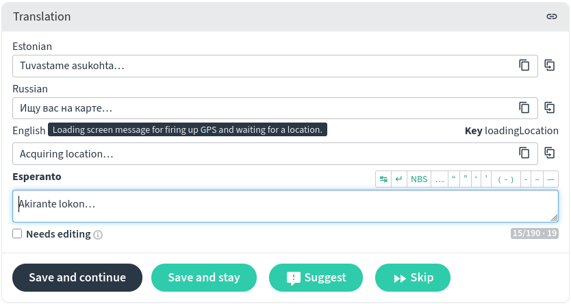

# Translating Every Door

OpenStreetMap is used and created in virtually every country of the world by people
of hundreds languages. While we abstract the data model in Every Door to make editing
more accessible, we cannot abstract words. Thus, we need your help with translating
every word in the editor to your own language.

## User Interface

The app is translated at [Weblate](https://hosted.weblate.org/projects/every-door/app/),
just like Go Map, MapComplete, and Organic Maps. All those projects will benefit from
your knowledge of this translation website.

Usually people open the Weblate page, then choose their language (there is an option
to add one if it's missing, and you won't need an approval), and start translating
strings one by one in the order suggested by the website.

### Weblate

Let's have a quick look at the translation panel. "Acquiring location" are the first
words people see when opening Every Door, so it's a good candidate for a showcase.

Here we're translating to Esperanto, and you can see the string is already there.
Above it is English: it is the source, reference language, and it has a string key
coming from the app, and a description in white-on-black. This description helps
understand where this string is displayed in the app. Russian and Estonian are
my secondary languages, which I have enabled in
[preferences](https://hosted.weblate.org/accounts/profile/#languages).

If you have no idea how to translate the string, click "Skip" or press "Ctrl+↓" (⌘↓ on Mac)
to show the next one. Otherwise simply type the translated text and press "Ctrl+Enter"
(⌘+Return) to move to the next line. It might help to look at comments and translation
history below the form.

You can find the complete [documentation](https://docs.weblate.org/en/latest/user/translating.html)
on translating with Weblate on their website.

### Parameters

Some strings contain words in figure brackets, e.g. `{count}`. **Do not translate those**!
Those are placeholders for values that come from the app. For example, in the line
"by {user} at {datetime}", the `{user}` part will be replaced with a user name, and
`{datetime}` — with a date. If you translate words inside brackets, that would be
an error preventing the app from compiling.

Plurals are even more tricky. Some lines need to have different translations based
on a number: e.g. "1 year", but "2 years". Conside this:

    {count,plural, =1{{count} year} few{{count} years} other{{count} years}} 

Here you should translate only "year(s)", but not `count,plural`, `few`, `other`, and
not `{count}`. So in Ukrainian, it becomes:

    {count,plural, =1{{count} рік} few{{count} роки} other{{count} років}}

Please be wary of these cases when translating.

### Process

You can search for specific strings and translate just a section of the app. For example,
all items in the Settings panel naturally have keys that start with `settings`, and
string keys for the opening hours editor start with `fieldHours`. However I would advise
translating everything in whatever order: some days or weeks later you will have dealt with
each of ~350 strings and the order won't matter.

Additionally there is a [Metadata](https://hosted.weblate.org/projects/every-door/metadata/)
component: there you can translate short and long descriptions, and a change log, into
your language for F-Droid store listings. Later it might be employed for other stores as well.

Translation services are offered to Every Door by Weblate for free, and we're grateful for that.

## Presets and Fields

The editor uses [presets from iD](https://github.com/openstreetmap/id-tagging-schema):
they are managed in a dedicated repository and translated
on [Transifex](https://app.transifex.com/openstreetmap/id-editor/presets/).
To translate, open the link, login if needed, choose your language and hit "Translate".
If you need a specific preset or a field, note the "Key" in the string context panel,
and search for something like `key:living_street` or `key:wheelchair`. Also note
the "Developer Notes" hint to the right.

If you have suddenly learned there is no preset or field to translate, see
[how to add those](presets.md).

Translating options for combo fields is tricky. First, you need to make sure those
are known. Find the field in the repository and check the `strings/options` map.
It should look [like here](https://github.com/openstreetmap/id-tagging-schema/blob/main/data/fields/camera/type.json).
If it is missing all or some options you think are required, please submit a pull
request there and wait until it is merged.

Then, when the translation source on Transifex is updated, there will be strings to translate.
Search for `key:fields.<path>`, e.g.
[key:fields.camera/type](https://app.transifex.com/openstreetmap/id-editor/translate/#fr/presets?q=key%3Afields.camera%2Ftype)
for `data/fields/camera/type.json`.
You can see both the label and the options there, ready for translating.

Presets from the Name Suggestion Index are considered local and are not translated.

## Plugins

Currently plugins can only be translated by their authors. You can manually download one
though, unpack it, and prepare a YAML file with a translation into your language.
Later it will be automated with the plugin repository, which will enable plugin translations
via Weblate.

See the [plugin translation](../plugins/metadata/index.md) section for the file format.

## Documentation

This website is made with MkDocs and hosted [on Github](https://github.com/Zverik/everydoor-website/tree/main/docs),
so it is easy to edit the contents. The Material theme also
[supports switching languages](https://squidfunk.github.io/mkdocs-material/setup/changing-the-language/#site-language-selector).
But alas it is pretty hard to set up when you don't have a paid subscription. If you know
how to do that, please submit a pull request. We would of course like to make this documentation
translatable.
