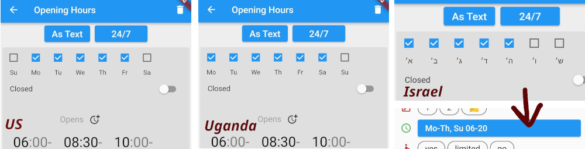
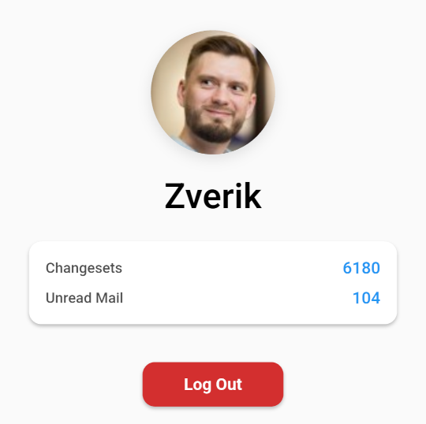

# Every Door 6.0

_Released on 26 June 2025_

This release is focused on one thing people (and the author too) have been waiting since 2022:

## Plugins

What is a plugin? The lines between configuration files, plugins, extensions,
and DLC are very thin. People have asked for more configurability, and for
custom builds for specific use cases. Every Door is very opinionated, and
hence is not as much configurable as some would prefer. Well, it got
more open now, with the introduction of plugins.

At the first stage, a plugin is a YAML file in an archive, directing which
tags to use, how things look, and what editing modes there are. While not
very flexible, it allows for custom imagery, custom presets and fields, and
entire custom workflows, for which you might have needed dedicated apps.

For example, the prototype [mapping pie dispencer](https://pie.osmz.ee/1)
makes it easy to download mapping area boundaries to Every Door, to know
where to map. In the future it could advise on imagery layers, show
a surveying manual, and even track the completion and share locations
with other participants.

Plugins are collected in [the Repository](https://plugins.every-door.app/).
It is accessible right from the app: go to Settings → Plugins → (+) button.
Uploading plugins is easy: you only need an OpenStreetMap account. But
there are also other ways of installing plugins, e.g. from a QR code.

See the [Plugins](../../plugins/index.md) section to learn how to use and how
to develop those.

## Amenity Editing

### Green Markers

After you have done the initial survey, the re-surveying often consists
of a single step: tapping the checkmark, confirming shops are still there.
"Yup, yup, still there, this one too, and this one..." The idea was, you look
at the tiles below the map and ignore the map. But when something's off, like
a shop missing, cross-referencing the legend with the map becomes hard.

So in this release, I tried to color confirmed amenities green. And it
made surveying faster and more fun!

### Dragging the Button

Did you know that in the entrances and notes modes, you could not only tap
(+) buttons, but also drag them onto the map? That would save you a second,
which is important when you're in a car, for example, collecting all the
addresses in a village.

Now the code has been restructured for the plugins, and this dragging
behaviour has also been added to the first two modes. Try dragging the button
next time you add a bench!

### Weekdays

Dmitry from Israel pointed out that the day order (and translations for
weekdays) were off. Turns out, in some countries days start not from
Monday, and some have a different set of weekends! Now Every Door knows
of local rules, and adjusts the opening hours panel accordingly.

### Fixme Objects

When you cannot find a correct type for a shop, you could type something
free-form into the search field, and tap on the red box to create
a special kind of amenity, `amenity=fixme`. It would record all the data,
so that later somebody could find the correct type and retag the object,
keeping the name, opening hours, phone numbers etc.

Alas the second step rarely happened, and mappers were complaining. To fix
that, Every Door will now convert such fixme amenity to an OSM note, in case
nothing but the name is provided. It will also highlight fixme amenities
marking them as objects to improve.

As for other objects with non-empty fixme values, which have been highlighted,
it is now easier to clear the `fixme` tag with a single tap. Thanks to Soham
Dixit, who has implemented the feature.

### Wrong State

Want to change the type of a shop? It's easy: tap the title in the header.
Presets specify which tags need to be removed and which to add. Alas, the
app forgot to remove the tags first, which resulted in some weird tagging
after a type switch. Not anymore.

Did not know you could change the object type? I have underlined the title
to make it more discoverable.

Note that when changing a type, now you won't get a full list of type suggestions.
This also is a result from restructuring the code, but feels to be a correct
way to go: I've never found a correct _replacement_ in those lists, because
they were made for initial surveying, not map gardening.

See a shop closed, but with a sign still there? Mark it disused by tapping
the orange button in the editor. It would add the `disused:` prefix to
its main tag, producing e.g. `disused:shop=clothes`. Alas with the
advancements to our tagging, and having multiple competing tagging
schemas, sometimes one prefix was not enough. In this release, Every Door
correctly manages prefixes for hospitals tagged with both `amenity=hospital`
and `healthcare=hospital`.

## Other

### Compass

Finally you can know where you are looking! Thanks to Siarhei Fedartsou,
the location marker has got a direction triangle.

### Profile

{ width="300" }

And Soham Dixit has improved the look of the OSM profile page. Nothing
new has been added there though, it's already perfect.

Note that due to a library update, you might need to re-login. In some
cases, even reinstall the app, although I don't expect that to happen.

### Buildings

Turns out "Cancel" buttons for buildings and entrances kept the changes.
That was very wrong and I have no idea how nobody caught it in three years.

Mxdanger has also updated roof shape images appearing in a building
editor form. Turns out they have made
[much more](https://commons.wikimedia.org/wiki/Category:Illustrations_of_roof_forms_(red_on_grey)) icons than we have seen!

### Translations

First, mappers in Serbia should have an easier time adding local names,
because thanks to Alnzrv, cyrillic and latin alphabets are now properly
split between `name:sr` and `name:sr-Latn`, which both appear by default
when you edit an amenity.

Also thanks to Yurt Page, app metadata, namely the description and changelogs,
can be translated. Those are used only for F-Droid for now, but in the future
someday I might add a Fastlane tool to use those translations when uploading
to other stores.

Finally, this release has added multiple strings, mostly related to plugins,
so I'm grateful to everyone who's translated those into their own languages.
Special thanks goes to Mandeep and Kim Kats for vastly improving Punjabi and
Greek localizations.

### System Changes

Every Door 6.0 now supports only Android 6 ("Marshmallow") or newer. Sorry to those two
users on 5.1 who's been left behind. Vespucci has still got you covered. But really,
it's over ten years old, and you can easily find newer phones for a few bucks,
or even free.

We also have a new QR code scanner. The previous one depended on proprietary MLKit,
not available on de-googled phones or in the F-Droid build. Now the app uses
an alternative open-source library that depends on ZXing for Android and
MTBBarcodescanner for iOS. Alas both libraries are in maintenance mode, but
they work good enough, at least the Android one. If you encounter any problems
scanning QR codes, please [report them](../../develop/bugs.md).

## New Website

This website has been migrated to Material for MkDocs, and its sections
are gradually filling in. We have a guide on [plugins](../../plugins/index.md)
and on [contributing in general](../../develop/index.md). User's guide and
video tutorials to follow this Summer.

## Thanks to NLNet

This release and the huge code restructuring and development work that went into it
were funded through the [NGI0 Commons Fund](https://nlnet.nl/commonsfund), a fund
established by [NLnet](https://nlnet.nl) with financial support from the
European Commission's [Next Generation Internet](https://ngi.eu) programme,
under the aegis of
[DG Communications Networks, Content and Technology](https://commission.europa.eu/about-european-commission/departments-and-executive-agencies/communications-networks-content-and-technology_en)
under grant agreement No [101135429](https://cordis.europa.eu/project/id/101135429).
Additional funding is made available by the
[Swiss State Secretariat for Education, Research and Innovation](https://www.sbfi.admin.ch/sbfi/en/home.html) (SERI).
