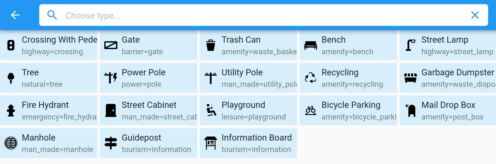
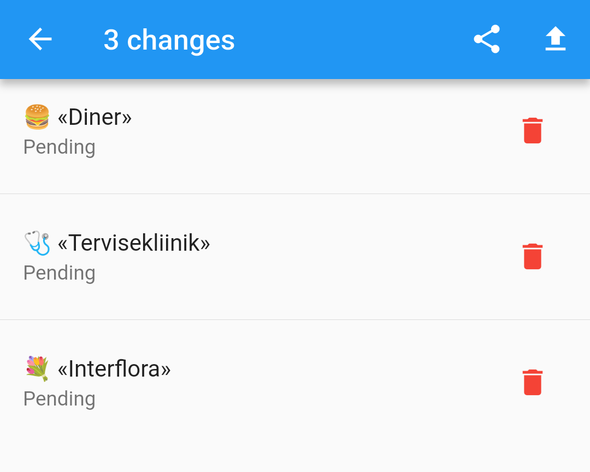

# Every Door 7.0

_Released on 24 September 2025_

The main thing in this release is...

## Imagery Improvements

### Vector Tiles

To be fair, Every Door does not need vector map tiles. Its base mode of operation is,
you look at amenities around you and find those in the list. Same way, other modes
often work better with a satellite imagery.

Except when you have no imagery. Or are inside a building, and mapping shops while staring
at a roof is not fun. Or the GPS is failing, and you have to find your location manually.
There can be many reasons why people resort to using [obsolete] OSM tiles while mapping,
dealing with discrepancy between what's on the server, and what's on the phone. The main
reason I was keeping in mind was offline work.

For a rectangular area roughly 1×1 km you would need to pre-download ~1400 tiles,
amounting to ~40 megabytes for a city. Same would take only 200 kilobytes with a vector
tile, of which you would need just one (at zoom 14). Which is 200 times less data and
thousand times less load on the server.

This enables Every Door to work offline by pre-downloading tiles: each vector tile covers
an 1×1 km area, which means, you need very few of them to map even a big rural area.
And tile downloading limits won't pose an issue.

Alas at the last moment I've decided to not make vector tiles the default. Since the
MapLibre package is not yet of production quality, the app uses a slower library, and
in both rendering options it provides, rendering was too slow, and had some weird artifacts.
So to enable vector tiles, please open the plugins pane, and install the
[Vector Base Map](https://plugins.every-door.app/vector_base) plugin. You can enable and
disable it at any time, the cache and the plugin stay on your phone and available offline.

### Predictable Caching

Another thing enabling offline work, is that you can know exactly when the cache is cleared,
and download tiles for an area at will.

The new data management panel includes the old button for clearing the downloaded OSM data,
but also adds multiple buttons for monitoring and clearing tile caches, for raster and vector
tiles separately.

Tap the "Download Tiles" button to open a map, on which you can select up to 20 rectangles
(equal to zoom 15 tiles, ~0.2–1 km²), and bulk download OSM data, base map tiles, and satellite
imagery tiles for those. Obviously data and vector tiles cover all the zoom levels, while
raster tiles are downloaded up to zoom 18 (which makes it 85 tiles downloaded for each selected
rectangle).

Everything downloaded stays in a separate cache, so even when you pan and zoom the map too much,
nothing explicitly requested will be silently deleted, like it happens with the regular
tile cache.

_Note:_ the bottom button for downloading tiles might be hidden by the phone UI on Android.
This will be fixed in the 7.1 update soon.

### Compass Button

{ width="400" }

Many people have asked for a button to reset the map rotation. Previously you have to
long-press on the location button for that. Which was very obscure. Now we get
a special compass button that both shows the rotation angle, and makes it zero
when tapped.

### Building Contours

Having vector tiles helped fix one issue with adding entrances to buildings.
To make them snap to correct location, you need to drag them as close to the building
contour as possible. But with a satellite layer enabled, you have no idea where the
contour in OSM is.

Now when adding an entrance, you can see white outlines for every building on the screen.
Those may have some artifacts on tile lines, but generally you can rely on those.

The outlines are not added on the separate map panel that appears when you tap a button
in the buildings mode. There you can switch a layer at will. It is only drawn on the map,
so that when you _drag_ a button onto the map, you see where you are dragging it to.

## Other Things

### Preset Icons

The amazing [iD Tagging Schema](https://github.com/openstreetmap/id-tagging-schema)
repository has an icon associated with most of the presets, and you must have seen
the iD editor displaying those. Now you can enjoy the icons in Every Door!

Obviously this works for plugins too, so you can have custom icons for your custom presets.

### Tap To Undo

{ width="400" }

Finally instead of video I can just put a static image here. When you experiment with
the editing, and need to revert some changes, it was not obvious how to do that.
The "Pending Changes" panel had a tiny hint at the bottom, but few people have noticed it.
Now I've decided to get rid of type icons, and instead add proper "delete" buttons
to every change.

Don't be afraid to delete a change accidentally: after you do, a panel appears giving
you a change to restore the change.

## Thanks to NLNet

This release was once again
funded through the [NGI0 Commons Fund](https://nlnet.nl/commonsfund), a fund
established by [NLnet](https://nlnet.nl) with financial support from the
European Commission's [Next Generation Internet](https://ngi.eu) programme,
under the aegis of
[DG Communications Networks, Content and Technology](https://commission.europa.eu/about-european-commission/departments-and-executive-agencies/communications-networks-content-and-technology_en)
under grant agreement No [101135429](https://cordis.europa.eu/project/id/101135429).
Additional funding is made available by the
[Swiss State Secretariat for Education, Research and Innovation](https://www.sbfi.admin.ch/sbfi/en/home.html) (SERI).
