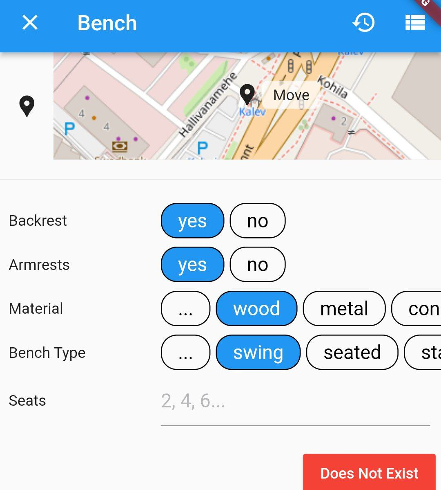
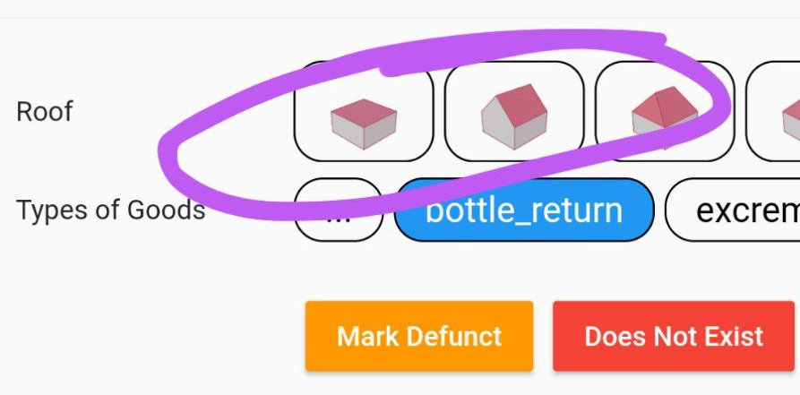

Every Door allows for adding and redefining presets and fields. By _presets_, we mean a set of tags that define an object, and a set of fields that appear in its editor panels. And _fields_ are items on those panels, like input fields or choice buttons.

# Presets

All presets go under the `presets` key in the `plugin.yaml` file, as "id-definition" maps. It's worth looking at the [iD preset schema](https://github.com/ideditor/schema-builder?tab=readme-ov-file#presets) documentation to understand the structure. Here's an example:

```yaml
presets:
  taaraautomaat:
    name: "Taaraautomaat"
    terms: [prügi]
    icon: taara.svg
    tags:
      amenity: vending_machine
      vending: bottle_return
    addTags:
      name: Taaraautomaat
      amenity: vending_machine
      vending: bottle_return
      "recycling:cans": yes
      "recycling:glass_bottles": yes
      "recycling:plastic_bottles": yes
      "recycling:refund_bottles": yes
    area: true
    fields:
      - roofShape
      - '@amenity/vending_machine/bottle_return'
```

Here it defines a preset with an identifier `taaraautomaat` (not present in the packaged database). What do the keys mean:

* `name`: a string label for the preset, displayed in the app bar of the editor panel, and on a tile in the type search panel.
* `terms`: additional search terms for the preset, so it's easier to find with the autocomplete search.
* `icon`: an icon to display in the search results tile. Can be an URL.
* `area`: whether this preset applies to closed polygons as well as points. `true` is the default.
* `tags`: a set of tags (as a key-value map) used to identify whether an object is of the given preset. In the example, it would mean that objects having `amenity=vending_machine` and `vending=bottle_return` tags will have this preset assigned to them, e.g. the editor will use the fields from this definition.
* `addTags`: which tags to add when creating the object with this preset. Should include the `tags` content.
* `removeTags`: which tags to remove when changing the type of the object to another preset.
* `fields`: a list of string identifiers of fields to present in an editor. Can include a reference to fields of another preset, starting with "@": in the example, it adds a custom field on top of the standard fields of a `bottle_return` preset. Currently you cannot reference plugin-packaged presets here.
* `moreFields`: same, but for the initially collapsed extended field list. If omitted, and when `fields` contain a reference to a preset, it will be populated from the `moreFields` list of that preset.
* `standard`: by default, the editor panel constructs a third group of fields, "standard fields". Those contain a name, address, and other stuff. For custom forms that could be undesired, so when this key is set to `false`, fields will be presented as-is.

If a `fields` list is missing, the preset is considered to be a part of a [name suggestion index](https://github.com/osmlab/name-suggestion-index): it will appear in a differently-colored tile in search results, and will have its fields retrieved from a matching normal preset.

Plugin presets take priority over bundled presets, so it is possible to override some of those. For example, this snippet adds a custom `benchType` field to the bench preset (while losing the translations and custom search terms):

```yaml
  amenity/bench:
    name: Bench
    tags:
      amenity: bench
    fields:
      - backrest
      - armrest
      - material
      - benchType
      - seats
    moreFields:
      - '@amenity/bench'
```

# Fields

Fields are commonly used in presets, and also share large parts of the schema with [iD presets](https://github.com/ideditor/schema-builder?tab=readme-ov-file#fields). In a plugin definition they go under a `fields` key, and just like presets, those are "id-definition" maps. Here is how the `benchType` field from the example above is defined:

```yaml
fields:
  benchType:
    label: Bench Type
    key: 'bench:type'
    type: combo
    options:
      - seated
      - stand_up
      - block
      - lounger
      - swing
      - platform
      - log
      - canton
      - circular
```

With the preset overridden, it looks like this in the object editor:

{ width="300" }

What keys can go in a field definition:

* `key`: which tag key does this field edit. Make sure to parenthesize keys with semicolons.
* `label`: field label, will be displayed alongside it on an editor page.
* `placeholder`: a faint grey label for text input fields.
* `prerequisiteTag`: tags that this field depends upon (see [here](https://github.com/ideditor/schema-builder?tab=readme-ov-file#prerequisitetag)).
* `type`: field type, which defines how it looks and what tags it affects.

Types are mostly the same as listed in the upstream schema, since the code shares the type resolver. There is one extra type supported for plugins: `inlineCombo` (can be abbreviated to `inline`). It is the same as a one-choice `combo`, but with a fixed limited set of options that are displayed all at once, not trimmed to three items. And when you press a "custom" option, it transforms into a text input field instead of opening a separate pane. See fields in the buildings and entrances mode pop-up editors for examples.

Combo fields have those keys as well:

* `customValues`: whether to allow custom values.
* `numeric`: whether custom values should be non-negative integer numbers (only applies to inline combos, `true` by default).
* `options`: a list of available values, presented as a set of buttons or a pop-up list.
* `labels`: a list of human-readable labels for each option, in order. For an inline combo, some or all labels can reference icons instead. For example:

```yaml
fields:
 roofShape:  
   label: Roof  
   key: "roof:shape"  
   type: inlineCombo  
   customValues: false  
   options:  
     - flat  
     - gabled  
     - hipped  
     - pyramidal  
     - skillion  
     - half-hipped  
     - round  
     - gambrel  
     - mansard  
   labels:  
     - roofs/flat.png  
     - roofs/gabled.png  
     - roofs/hipped.png  
     - roofs/pyramidal.png  
     - roofs/skillion.png  
     - roofs/half-hipped.png  
     - roofs/round.png  
     - roofs/gambrel.png  
     - roofs/mansard.png
```

And it looks like this in an editor:

{ width="300" }

Note that while a list of options defines all possible options one can choose in the editor, OSM data can have different values, and those will be displayed as textual labels when a matching icon is not found.
